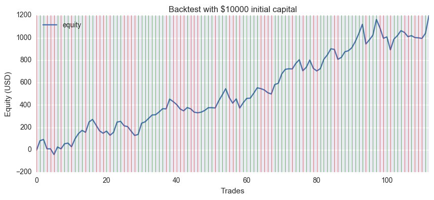

# Predicting Financial Time Series Data with Machine Learning
This is an example that predicts future prices from past price movements. Here we implement it with EUR/USD rate as an example, and you can also predict stock prices by changing symbol.

## Backtest example for EUR/USD
Using daily close prices from 2008 to 2016, first 95% for training and last 5% for testing. Green and red vertical lines represent winning trade and losing trade respectively.

## Installation
To run this demo, you need following environment and libraries.
- Python 2.7 (not tested on 3.x)
- Jupyter Notebook
- Scikit-learn
- numpy
- pandas
- matplotlib
- seaborn

**Note:**  You may need extra libraries to install above.

## License
MIT License, Copyright (c) 2017
